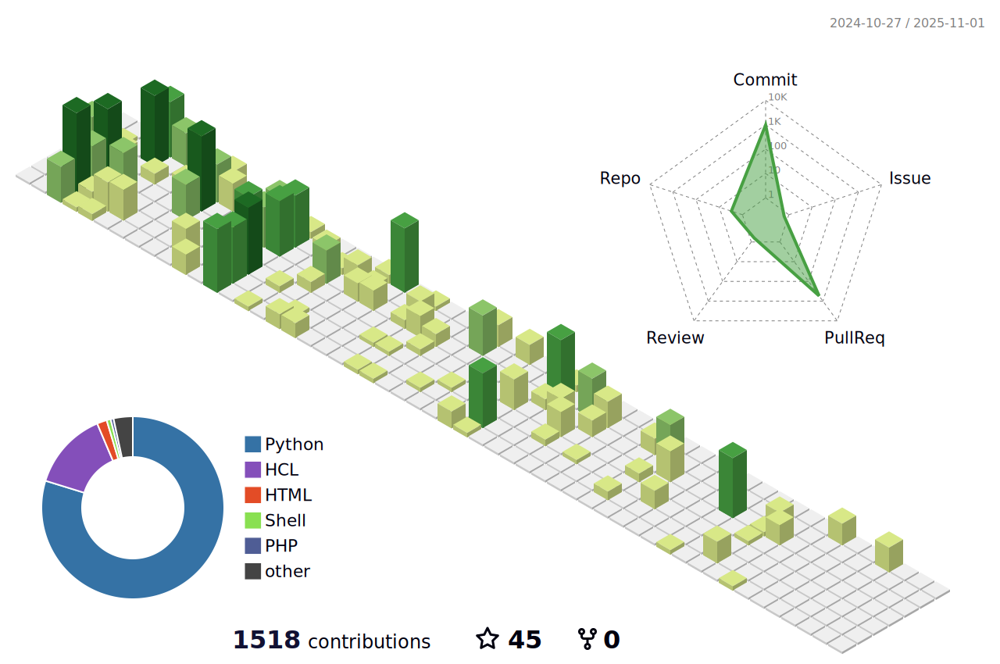

\
ⓘ About Me:

I’m a passionate Dev(Sec)Ops Engineer ♾️ with a sharp focus on security ☠💻🔑🛡. My mission is to craft secure, scalable pipelines while diving deep into the ever-evolving world of cybersecurity, which fuels my passion and curiosity. From coding </>💻 to containers ☸️🐋 and AI 🤖🧠 to automation 🤖⚙️🔧🦾👩‍💻💻, I thrive on building cutting-edge solutions that merge development efficiency with airtight security 🔒🛡️.

Whether it's writing clean code in Python 🐍, deploying Kubernetes clusters ☸, or leveraging AI models 🤗 to bring machine learning into production, I always keep security at the heart 🤍 of everything I do. I’m driven by the belief that innovation 🚀 and security should go hand in hand 🫱🏼‍🫲🏻, and I’m always exploring new ways to elevate both.

<!--
**meleksabit/meleksabit** is a ✨ _special_ ✨ repository because its `README.md` (this file) appears on your GitHub profile.

Here are some ideas to get you started:

- 🔭 I’m currently working on ...
- 🌱 I’m currently learning ...
- 👯 I’m looking to collaborate on ...
- 🤔 I’m looking for help with ...
- 💬 Ask me about ...
- 📫 How to reach me: ...
- 😄 Pronouns: ...
- ⚡ Fun fact: ...
-->
